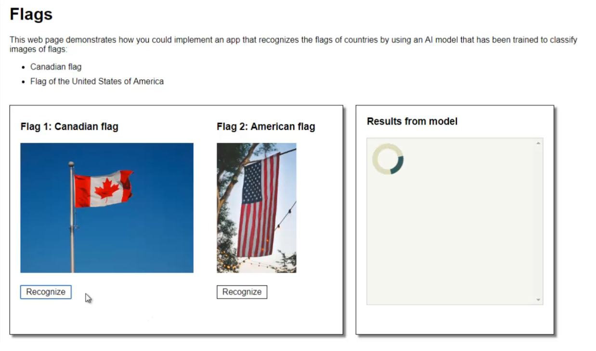
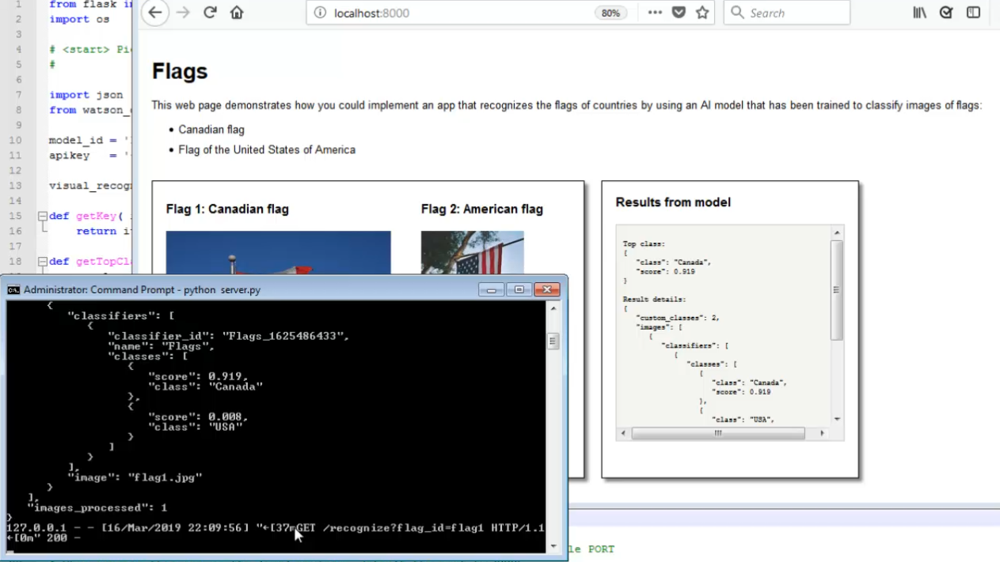

# From wild idea to AI app:
## How Watson Studio can help you rapidly prototype AI solutions
### Flags national anthem app

IBM Watson Studio has powerful machine learning and deep learning features. But did you know it also has simple tools for quickly training and deploying AI models and for prototyping app code? In this session, we'll show you how to leverage open data to train a visual recognition model using the graphical model builder in Watson Studio and then create a web app that uses that model.

This sample demonstrates how to build a web app that uses a visual recognition model to classify images of flags and then play the national anthem of the country of the flag:

This sample includes:
- Training data and test images of flags
- A short Python notebook for testing the model 
- A longer Python notebook for prototyping app code
- Python Flask web app code
- Instructions and videos showing how to train and test the visual recognition model in [IBM Watson Studio](https://cloud.ibm.com/catalog/services/watson-studio), how to run the web app on your local computer, and how to push the web app to IBM Cloud

You can complete this sample using the free (Lite) version of these services:
- [IBM Cloud](https://cloud.ibm.com/registration)
- [IBM Watson Studio](https://cloud.ibm.com/catalog/services/watson-studio)
- [IBM Watson Visual Recognition](https://cloud.ibm.com/catalog/services/visual-recognition)
- [Python web app on IBM Cloud](https://cloud.ibm.com/catalog/starters/python) (free for 30 days)

&nbsp;

## Demo video

&nbsp;

## Instructions
These instructions describe how to build the sample web app with given, open source images for training and testing.

&nbsp;

### Prerequisites

<ol>
<li>
Sign up for IBM Cloud: <a href="https://www.ibm.com/cloud/">IBM Cloud sign up</a>
</li>
<li>
Create an instance of the IBM Watson Studio service on IBM Cloud: <a href="https://cloud.ibm.com/catalog/services/watson-studio">IBM Watson Studio</a>
</li>
<li>
Create a project in Watson Studio:

    <ol>
    <li>Go to https://dataplatform.cloud.ibm.com and log in (if you are not already logged in)</li>
    <li>Click <b>New project</b>, select <b>Visual Recognition</b>, and then follow the prompts to associate needed services with the project: IBM Cloud Object Storage and IBM Watson Visual Recognition.</li>
    </ol>
    
See also: <a href="https://dataplatform.cloud.ibm.com/docs/content/getting-started/projects.html">Creating projects</a></li>
<li>
To be able to run the sample web app on your local computer, <a href="https://www.python.org">install Python</a>

    <ul>
    <li>Make sure to have the installer add Python to your environments variables</li>
    <li>Mac users, also install <code>pip</code> by issuing this command: <pre><code>sudo easy_install pip</code></pre></li>
    <li>Mac users, also add your user base binary directory to your path:
        <ol>
        <li>Find the user base binary directory by running this command: <pre><code>python -m site --user-base</code></pre></li>
        <li>Add your user base binary directory, with <code>/bin</code> appended, to the file <code>/etc/paths</code></li>
        </ol>
        
See: <a href="https://www.architectryan.com/2012/10/02/add-to-the-path-on-mac-os-x-mountain-lion">Complete instructions</a>
</li>
    </ul></li>
<li>To be able to push the sample web app to IBM Cloud, <a href="https://console.bluemix.net/docs/cli/reference/ibmcloud/download_cli.html#install_use">install the IBM Cloud CLI</a></li>
</ol>

&nbsp;

### Step 1: Collect training and test data

1. 
Download these two .zip files to your local computer: <a href="flags-model/training_data">Training data</a>

2. 
Download these 10 images to your local computer: <a href="flags-model/test_images">Test images</a>

#### About the sample training data and test images

- The sample training data includes 17 images of the American flag and 19 images of the Canadian flag
- The sample test images are 10 images that were not part of the training data

<table>
<tr>
  <td></td>
  <td></td>
</tr>
<tr>
  <td></td>
  <td></td>
</tr>
</table>

See the <a href="#credits">image credits and citations</a>

#### Tips and comments
- 
With the IBM Watson Visual Recognition service, you can use images as small as 224 x 224 pixels with no loss of performance.  So, preprocessing training images to be 224 x 224  can make life easier (faster upload times, for example, than when using larger images.)

- 
The guidelines recommend including at least 50 training images in each class.  However, if you don't have 50 images for one or more classes, try to train the model with what you have, because it might work well enough for you.  (The sample training data here has 17 and 19 images for each of the two classes.)

- 
Including a negative class in training isn't always needed.  Experiment to determine what works best for your case.  (This sample does not include a negative class.)

See: [IBM Watson Visual Recognition guidelines for good training](https://console.bluemix.net/docs/services/visual-recognition/customizing.html#customizing-guidelines-training)

&nbsp;

### Step 2: Create a visual recognition model in your Watson Studio project

1. 
Click <b>Add to project</b> and then click <b>VISUAL RECOGNITION MODEL</b>.  Follow prompts to associate an instance of the IBM Visual Recognition service with your project.  This opens the visual recognition model builder.

2. 
Replace the name "Default Custom Model" with a name you choose.

3. 
In the data panel, drag and drop (or browse for) the two .zip files you downloaded in Step 1.

4. 
In the data panel, select all of the the .zip files and then click <b>Add to model</b>.

5. 
Rename each of the classes to remove <code>.zip</code> from the end of the name.

7. 
Click <b>Train model</b>.

See also: <a href="https://dataplatform.cloud.ibm.com/docs/content/analyze-data/visual-recognition-train.html">Training a visual recognition model</a>

&nbsp;

### Step 3: Test the model in Watson Studio

1. 
When training is complete, a link to the model details page is given in a message.  Click the link to go to the model details page.  (Alternatively, click on the model name in the <b>Assets</b> page of your project to get to the model details page.)

2. 
Click the <b>Test</b> tab.

3. 
Download these test images to your local computer: <a href="flags-model/test_images">Test images</a>

4. 
Drag test images onto the test area for classification.

&nbsp;

### Step 4: Work with your trained model in a notebook in Watson Studio

**Note:**  Both sample notebooks work in the FREE Python 3.5 environment in Watson Studio.

#### 4.1

<ol>
<li>
Add the first sample notebook, <code>flags-test-notebook</code>, to your project:

    <ol>
    <li>Click <b>Add to project</b> and then click <b>NOTEBOOK</b></li>
    <li>Click the tab labeled <b>From URL</b></li>
    <li>In the box labeled <b>Notebook URL</b>, paste the URL of this sample notebook: <a href="flags-notebooks/flags-test-notebook.ipynb"><code>flags-test-notebook</code></a></li>
    <li>Give the notebook a name</li>
    <li>Click <b>Create Notebook</b></li>
    </ol></li>
<li>
Paste your model ID and credentials into the notebook:

    <ol>
    <li>From the <b>Services</b> sub-menu of the main, navigation menu, open <b>Watson Services</b> in a new browser tab</li>
      <li>Beside your instance of the IBM Watson Visual Recognition service, click <b>Launch tool</b></li>
      <li>In the <b>Overview</b> tab, scroll down to find the model you created in Step 2, and then copy the model ID</li>
      <li>Paste the model ID in the notebook where needed</li>
      <li>Back in the <b>Credentials</b> tab of the Visual Recognition tool, create some test credentials, and then copy the <code>apikey</code> value</li>
      <li>Paste the apikey in the notebook where needed</li>
    </ol></li>
<li>
Read, explore, and run the cells of the sample notebook.  Learn how to use the Watson Visual Recognition Python client to classify test images.
</li>
</ol>

#### 4.2

Repeat the steps in 4.1 with the second sample notebook, `flags-app-code-notebook`.

In this notebook, you can see some how to define some functions that will be needed in the sample Python web app.

See also:
- [Notebooks in Watson Studio](https://dataplatform.cloud.ibm.com/docs/content/analyze-data/notebooks-parent.html)
- [IBM Watson Visual Recognition API](https://cloud.ibm.com/apidocs/visual-recognition?code=python)

**Demo video**

&nbsp;

### Step 5: Copy prototype code into a web app

1. 
Download and unzip the sample app from here: <a href="flags-web-app/flags-web-app.zip">Sample Python Flask web app</a>

2. 
In the file <code>server.py</code>, paste your model ID and credentials (just like in the sample notebooks)

3. 
Notice that the functions <code>getKey</code>, <code>getTopClass</code>, and <code>classifyFlag</code> that were prototyped in the notebook are used in the file <code>server.py</code>
</a>

#### Sample file highlights
<table>
<tr>
  <th>File</th>
  <th>Description</th>
</tr>
<tr>
  <td><code>README.md</code></td>
  <td>Instructions for running the app locally and pushing the app to IBM Cloud</td>
</tr>
<tr>
  <td><code>server.py</code></td>
  <td>Python Flask server code for the app</td>
</tr>
<tr>
  <td><code>static/index.html</code></td>
  <td>HTML and Javascript (AJAX) for the web page interface of the app</td>
</tr>
<tr>
  <td><code>static/css/styles.css</code></td>
  <td>Controls the appearance of the web page</td>
</tr>
<tr>
  <td><code>static/audio/*.wav</code></td>
  <td>Audio for indicating classification results</td>
</tr>
</table>

&nbsp;

### Step 6: Run the app on your local computer

1. Open a command prompt and then navigate to the directory containing the file <code>server.py</code>
2. From the command line, start the Python Flask server by issuing the following command: <pre><code>python server.py</code></pre>
3. Open a web browser to: [http://localhost:8000/](http://localhost:8000)
4. Classify one of the test images

**Demo video**

&nbsp;

### Step 7: Push the app to the public cloud

<ol>
  <li>
In IBM Cloud, create a Python Flask Cloud Foundry app, size 128 MB: <a href="https://console.bluemix.net/catalog/starters/python">Python Flask starter app</a>
</li>
  <li>
In the local file named <code>manifest.yml</code>, replace <code>app-name</code> with the name you chose for your Python Flask app starter:
<pre><code>applications:
- name: app-name
  memory: 128M
</code></pre>
</li>
<li>
In the local file named <code>setup.py</code>, replace <code>app-name</code> with the name you chose for your Python Flask app starter:
<pre><code>setup(
    name='app-name',
    version='1.0.0',
...
</code></pre>
</li>
  <li>
On the command line, login to your IBM Cloud account by issuing the following command:
<pre><code>ibmcloud login
</code></pre>
</li>
  <li>
On the command line, target the CloudFoundry API endpoint by issuing the following command:
<pre><code>ibmcloud target --cf
</code></pre>
</li>
  <li>
On the command line, from the app working directory (where the file server.py is located)
push your app to IBM Cloud by issuing the following command:
<pre><code>ibmcloud app push
</code></pre>
</li>
</ol>

**Demo video**

&nbsp;

# Image credits and citations

#### Images from Unsplash (https://unsplash.com/license)
- Photo by Joshua Hoehne (https://unsplash.com/photos/pSSYVe4rcs0)
- Photo by Joshua Hoehne (https://unsplash.com/photos/7s1j-DZ5KYQ)
- Photo by DAVIDCOHEN (https://unsplash.com/photos/7lmq5Gniypg)
- Photo by Jordhan Madec (https://unsplash.com/photos/0RMgorRDQQY)
- Photo by Anthony DELANOIX (https://unsplash.com/photos/nxpw92fiGw8)
- Photo by Jp Valery (https://unsplash.com/photos/-ph1Fqhx5Ko)
- Photo by Matt Botsford (https://unsplash.com/photos/Jf4lKpDgklI)
- Photo by Alex Martinez (https://unsplash.com/photos/G0SLCrt5OCY)
- Photo by Marco Krenn (https://unsplash.com/photos/iVtNNdvhldA)
- Photo by Jordan Crawford (https://unsplash.com/photos/aE94tJ61F1E)
- Photo by Raúl Nájera (https://unsplash.com/photos/TAqspfWom04)
- Photo by Adam Birkett (https://unsplash.com/photos/Zf4NoRKEhtE)
- Photo by Kevin Morris (https://unsplash.com/photos/yB5PHCOgPeo)
- Photo by Cal Engel (https://unsplash.com/photos/4IzblBCtVyk)
- Photo by Valentino Funghi (https://unsplash.com/photos/fUWCe_pPPY0)
- Photo by Jacob Morrison (https://unsplash.com/photos/-RO2DFPl7wE)
- Photo by Cris DiNoto (https://unsplash.com/photos/OiQUrC4pgZc)
- Photo by Jonathan Denney (https://unsplash.com/photos/Ds0xACooELY)
- Photo by Pam Menegakis (https://unsplash.com/photos/Qp4VpgQ7-KM)
- Photo by Hermes Rivera (https://unsplash.com/photos/ahHn48-zKWo)

#### Images licences under CC0 Public Domain
- https://www.publicdomainpictures.net/en/view-image.php?image=86181&picture=heart-flag-canada
- https://www.publicdomainpictures.net/en/view-image.php?image=56959&picture=canadian-flag
- https://www.publicdomainpictures.net/en/view-image.php?image=87954&picture=torn-american-flag
- https://pixabay.com/en/canadian-flag-canada-maple-country-1229484/
- https://pixabay.com/en/flag-canadian-country-nation-220052/
- https://pixabay.com/en/canada-north-america-national-flag-1157521/
- https://pixabay.com/en/canada-hand-flag-country-pride-649858/
- https://pixabay.com/en/canada-flag-hdr-2262774/
- https://pixabay.com/en/flag-canada-red-white-canadian-472394/
- https://pixabay.com/en/international-flag-liberia-2694616/

#### Images from Country Flags (https://www.countryflags.com/en/), part of roll-up (https://www.roll-up.com/en/)
- canada-flag-medium.jpg (https://www.countryflags.com/en/canada-flag-image.html)
- canada-flag-wave-medium.jpg (https://www.countryflags.com/en/canada-flag-image.html)
- canada-flag-waving-medium.jpg (https://www.countryflags.com/en/canada-flag-image.html)
- canada-flag-heart-3d-medium.jpg (https://www.countryflags.com/en/canada-flag-image.html)

&nbsp;

=======

Copyright © 2019 IBM. This tutorial and its source code are released under the terms of the MIT License.

