# From wild idea to AI app:
## How Watson Studio can help you rapidly prototype AI solutions
### Scavenger hunt BINGO

IBM Watson Studio has powerful machine learning and deep learning features. But did you know it also has simple tools for quickly training and deploying AI models and for prototyping app code? This example shows you how to train a visual recognition model using the graphical model builder in Watson Studio and then create a fun, scavenger hunt app that uses that model.

This sample demonstrates how to build a scavenger hunt BINGO web app that uses a visual recognition model to classify images:

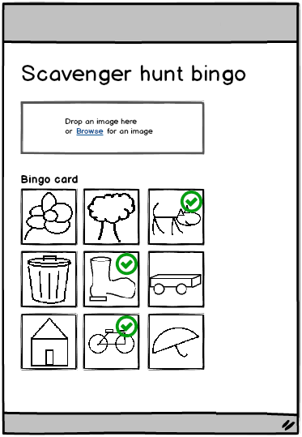

This sample includes:
- Training data and test images of indoor objects
- A Python notebook for prototyping app code
- Python Flask web app code
- Instructions and videos showing how to train and test the visual recognition model in [IBM Watson Studio](https://cloud.ibm.com/catalog/services/watson-studio), how to run the web app on your local computer, and how to push the web app to IBM Cloud

You can complete this sample using the free (Lite) version of these services:
- [IBM Cloud](https://cloud.ibm.com/registration)
- [IBM Watson Studio](https://cloud.ibm.com/catalog/services/watson-studio)
- [IBM Watson Visual Recognition](https://cloud.ibm.com/catalog/services/visual-recognition)
- [Python web app on IBM Cloud](https://cloud.ibm.com/catalog/starters/python) (free for 30 days)

&nbsp;

## Demo videos

<table>
  <tr>
    <th>Indoor scavenger hunt BINGO</th>
    <th>San Francisco scavenger hunt BINGO</th>
  </tr>
  <tr>
        <td></td>
    <td></td>
  </tr>
</table>

&nbsp;

## Instructions
These instructions describe how to build a scavenger hunt BINGO sample web app with given, indoor objects.

After you get the sample working, collect images of your favorite objects or tourist destinations and make your own scavenger hunt BINGO app!

&nbsp;

### Prerequisites

<ol>
<li>
Sign up for IBM Cloud: <a href="https://www.ibm.com/cloud/">IBM Cloud sign up</a>
</li>
<li>
Create an instance of the IBM Watson Studio service on IBM Cloud: <a href="https://cloud.ibm.com/catalog/services/watson-studio">IBM Watson Studio</a>
</li>
<li>
Create a project in Watson Studio:

    <ol>
    <li>Go to https://dataplatform.cloud.ibm.com and log in (if you are not already logged in)</li>
    <li>Click <b>New project</b>, select <b>Visual Recognition</b>, and then follow the prompts to associate needed services with the project: IBM Cloud Object Storage and IBM Watson Visual Recognition.</li>
    </ol>
    
See also: <a href="https://dataplatform.cloud.ibm.com/docs/content/getting-started/projects.html">Creating projects</a></li>
<li>
To be able to run the sample web app on your local computer, <a href="https://www.python.org">install Python</a>

    <ul>
    <li>Make sure to have the installer add Python to your environments variables</li>
    <li>Mac users, also install <code>pip</code> by issuing this command: <pre><code>sudo easy_install pip</code></pre></li>
    <li>Mac users, also add your user base binary directory to your path:
        <ol>
        <li>Find the user base binary directory by running this command: <pre><code>python -m site --user-base</code></pre></li>
        <li>Add your user base binary directory, with <code>/bin</code> appended, to the file <code>/etc/paths</code></li>
        </ol>
        
See: <a href="https://www.architectryan.com/2012/10/02/add-to-the-path-on-mac-os-x-mountain-lion">Complete instructions</a>
</li>
    </ul></li>
<li>To be able to push the sample web app to IBM Cloud, <a href="https://console.bluemix.net/docs/cli/reference/ibmcloud/download_cli.html#install_use">install the IBM Cloud CLI</a></li>
</ol>

&nbsp;

### Step 1: Collect training and test data

1. 
Download these 12 .zip files to your local computer: <a href="indoor-scavenger-hunt-model/training_data">Training data</a>

2. 
Download these 11 images to your local computer: <a href="indoor-scavenger-hunt-model/test_images">Test images</a>

#### About the sample training data

The sample training data includes 25 images of 11 indoor objects:

<table>
<tr>
  <td><b>bowl</b> 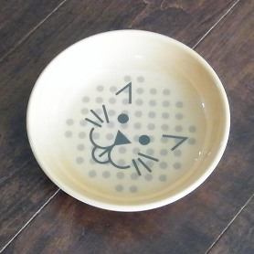</td>
  <td><b>brush</b> </td>
  <td><b>bucket</b> </td>
  <td><b>cup</b> 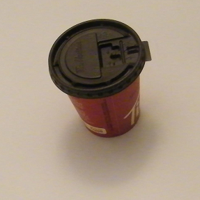</td>
  <td><b>glove</b> 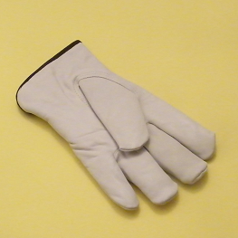</td>
  <td><b>hockey tape</b> </td>
</tr>
<tr>
  <td><b>measuring tape</b> </td>
  <td><b>pig</b> 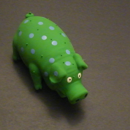</td>
  <td><b>puzzle</b> 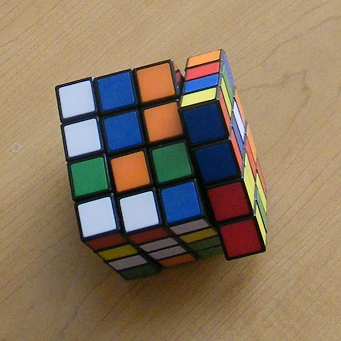</td>
  <td><b>shoe</b> 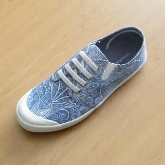</td>
  <td><b>stapler</b> </td>
</tr>
</table>

The images include 8 different backgrounds:

<table>
<tr>
  <td><b>white</b> </td>
  <td><b>yellow</b> </td>
  <td><b>beige</b> </td>
  <td><b>blue</b> </td>
</tr>
<tr>
  <td><b>green</b> </td>
  <td><b>black</b> </td>
  <td><b>dark wood</b> </td>
  <td><b>light wood</b> </td>
</tr>
</table>

The file `_negative.zip` contains images of only backgrounds, to be used as a negative class in training the model.

#### About the sample test images

The sample test images are 11 images that were not part of the training data:

<table>
<tr>
  <td>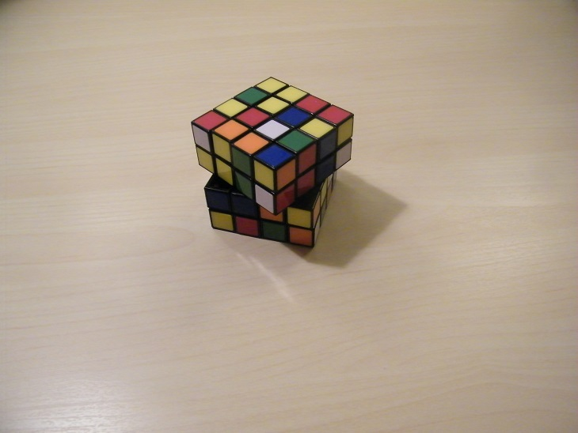</td>
  <td>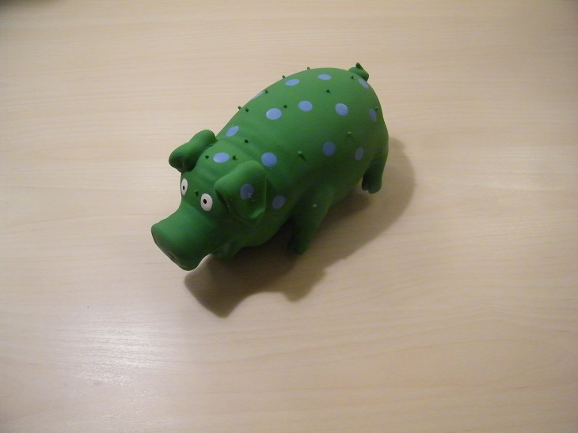</td>
  <td>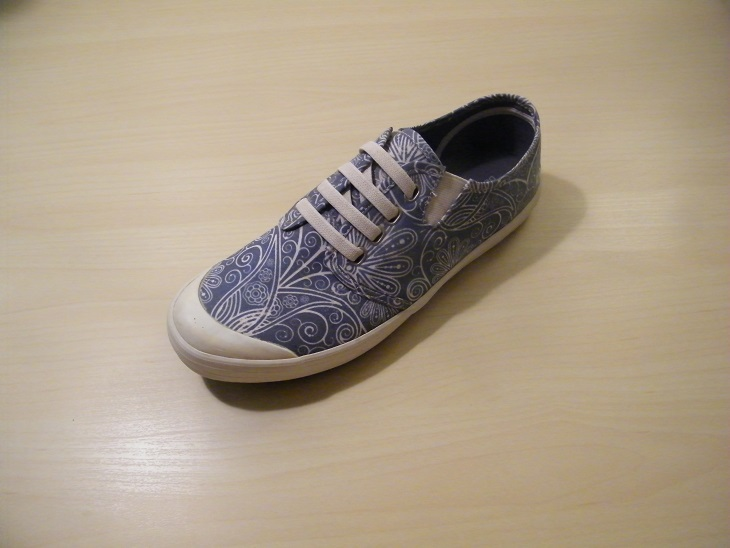</td>
  <td></td>
  <td>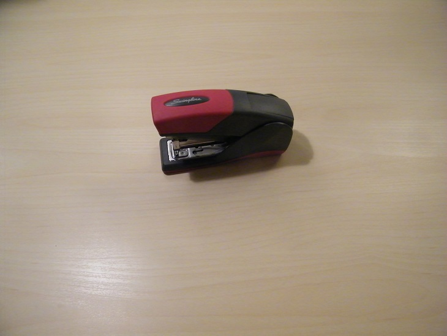</td>
  <td>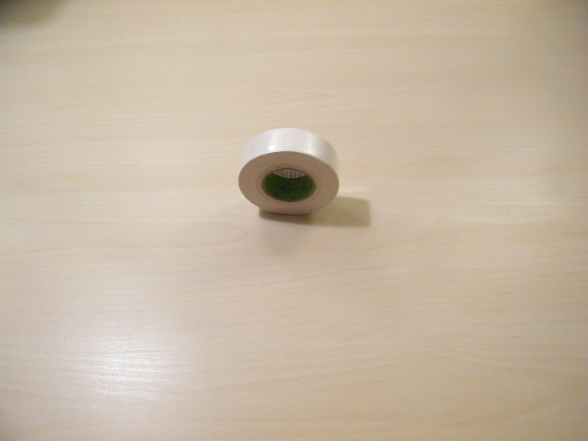</td>
</tr>
<tr>
  <td>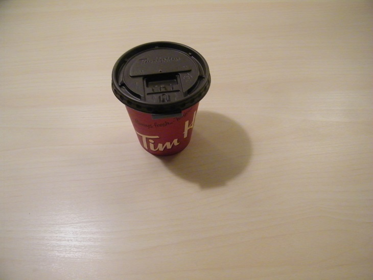</td>
  <td>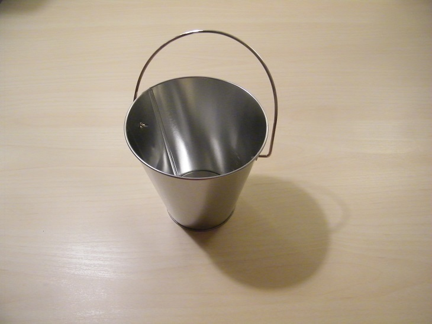</td>
  <td>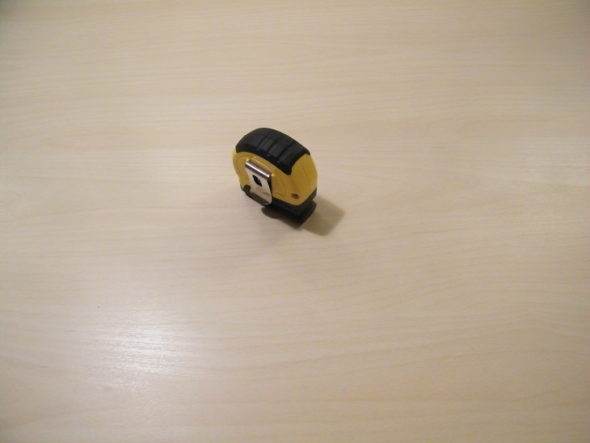</td>
  <td></td>
  <td>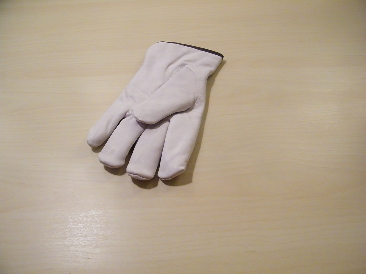</td>
</tr>
</table>

#### Tips and comments
- 
With the IBM Watson Visual Recognition service, you can use images as small as 224 x 224 pixels with no loss of performance.  So, preprocessing training images to be 224 x 224  can make life easier (faster upload times, for example, than when using larger images.)

- 
The guidelines recommend to "make sure that the backgrounds in your training images are comparable to what you expect to classify."  In our scavenger hunt scenario, the run-time background might vary.  So, the sample training images include a variety of possible backgrounds.

- 
The guidelines recommend including at least 50 training images in each class.  However, if you don't have 50 images for one or more classes, try to train the model with what you have, because it might work well enough for you.  (The sample training data here has 25 images for each class.)

- 
Because objects might be in any orientation in a scavenger hunt scenario, the training data includes images of the objects positioned every which way.  For use cases where you know the run-time orientation of objects being classified, this might not be what you want to do.

- 
Including a negative class in training isn't always needed.  Experiment to determine what works best for your case.  (This sample includes a negative class.)

- 
The guidelines recommend that the subject in the images take up at least 1/3 of the image.  In our case, we made a guess about where people playing a scavenger hunt would position their camera.  This meant that the measuring tape and hockey tape would be smaller in the training images than the other objects.

See: [IBM Watson Visual Recognition guidelines for good training](https://console.bluemix.net/docs/services/visual-recognition/customizing.html#customizing-guidelines-training)

&nbsp;

### Step 2: Create a visual recognition model in your Watson Studio project

1. 
Click <b>Add to project</b> and then click <b>VISUAL RECOGNITION MODEL</b>.  Follow prompts to associate an instance of the IBM Visual Recognition service with your project.  This opens the visual recognition model builder.

2. 
Replace the name "Default Custom Model" with a name you choose.

3. 
In the data panel, drag and drop (or browse for) the 12 .zip files you downloaded in Step 1.

4. 
In the data panel, select all of the the .zip files except <code>_negative.zip</code>, and then click <b>Add to model</b>.

5. 
Rename each of the classes to remove <code>.zip</code> from the end of the name.

6. 
From the data panel, drag the file <code>_negative.zip</code> onto the <b>Negative</b> class card.

7. 
Click <b>Train model</b>.

See also: <a href="https://dataplatform.cloud.ibm.com/docs/content/analyze-data/visual-recognition-train.html">Training a visual recognition model</a>

**Demo video**

&nbsp;

### Step 3: Test the model in Watson Studio

1. 
When training is complete, a link to the model details page is given in a message.  Click the link to go to the model details page.  (Alternatively, click on the model name in the <b>Assets</b> page of your project to get to the model details page.)

2. 
Click the <b>Test</b> tab.

3. 
Download these test images to your local computer: <a href="indoor-scavenger-hunt-model/test_images">Test images</a>

3. 
Drag test images onto the test area for classification.

**Demo video**

&nbsp;

### Step 4: Prototype app code in a notebook in Watson Studio

<ol>
<li>
Add a sample notebook to your project:

    <ol>
    <li>Click <b>Add to project</b> and then click <b>NOTEBOOK</b></li>
    <li>Click the tab labeled <b>From URL</b></li>
    <li>In the box labeled <b>Notebook URL</b>, paste the URL of this sample notebook: <a href="notebook/indoor-scavenger-hunt-notebook.ipynb">Sample notebook</a></li>
    <li>Give the notebook a name</li>
    <li>Click <b>Create Notebook</b></li>
    </ol></li>
<li>
Paste your model ID and credentials into the notebook:

    <ol>
    <li>From the <b>Services</b> sub-menu of the main, navigation menu, open <b>Watson Services</b> in a new browser tab</li>
      <li>Beside your instance of the IBM Watson Visual Recognition service, click <b>Launch tool</b></li>
      <li>In the <b>Overview</b> tab, scroll down to find the model you created in Step 2, and then copy the model ID</li>
      <li>Paste the model ID in the notebook where needed</li>
      <li>Back in the <b>Credentials</b> tab of the Visual Recognition tool, create some test credentials, and then copy the <code>apikey</code> value</li>
      <li>Paste the apikey in the notebook where needed</li>
    </ol></li>
<li>
Read, explore, and run the cells of the sample notebook.  Learn how to use the Watson Visual Recognition Python client to classify test images.  And begin to define functions that would be needed in a demo Python web app.

</ol>

See also:
- [Notebooks in Watson Studio](https://dataplatform.cloud.ibm.com/docs/content/analyze-data/notebooks-parent.html)
- [IBM Watson Visual Recognition API](https://cloud.ibm.com/apidocs/visual-recognition?code=python)

**Demo video**

<a href="https://youtu.be/p5xDP5R-GtY">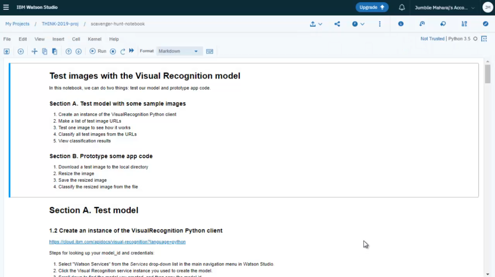</a>

&nbsp;

### Step 5: Copy prototype code into a web app

1. 
Download and unzip the sample app from here: <a href="indoor-scavenger-hunt-web-app/indoor-scavenger-hunt-web-app.zip">Sample Python Flask scavenger hunt app</a>

2. 
In the file <code>server.py</code>, paste your model ID and credentials (just like in the sample notebook)

3. 
Notice that the functions <code>getKey</code>, <code>getTopClass</code>, <code>classifyImage</code>, and <code>resizeImage</code> that were prototyped in the notebook are used in the file <code>server.py</code>

#### Sample file highlights
<table>
<tr>
  <th>File</th>
  <th>Description</th>
</tr>
<tr>
  <td><code>server.py</code></td>
  <td>Python Flask server code for the app</td>
</tr>
<tr>
  <td><code>static/index.html</code></td>
  <td>HTML for the web page interface of the app</td>
</tr>
<tr>
  <td><code>static/javascript/javascript.js</code></td>
  <td>Javascript functions implementation callbacks for the web page</td>
</tr>
<tr>
  <td><code>static/css/styles.css</code></td>
  <td>Controls the appearance of the web page</td>
</tr>
<tr>
  <td><code>static/images/exemplars/*.png</code></td>
  <td>Images for the BINGO card</td>
</tr>
<tr>
  <td><code>static/audio/*.wav</code></td>
  <td>Audio for indicating classification results</td>
</tr>
</table>

**Demo video**

<a href="https://youtu.be/AvX8nwS5eeg">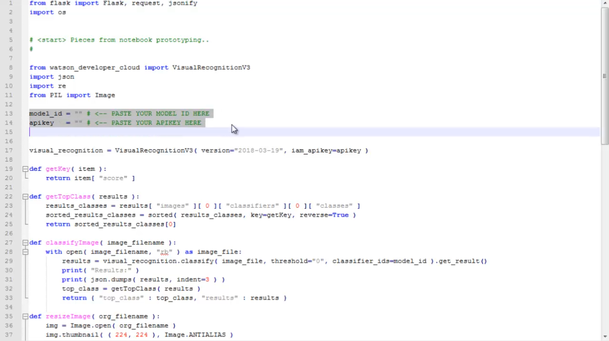</a>

&nbsp;

### Step 6: Run the app on your local computer

1. Open a command prompt and then navigate to the directory contianing the file <code>server.py</code>
2. From the command line, start the Python Flask server by issuing the following command: <pre><code>python server.py</code></pre>
3. Open a web browser to: [http://localhost:8000/](http://localhost:8000)
4. Classify one of the test images

**Demo video**

&nbsp;

### Step 7: Push the app to the public cloud

<ol>
  <li>
In IBM Cloud, create a Python Flask Cloud Foundry app, size 128 MB: <a href="https://console.bluemix.net/catalog/starters/python">Python Flask starter app</a>
</li>
  <li>
In the local file named <code>manifest.yml</code>, replace <code>app-name</code> with the name you chose for your Python Flask app starter:
<pre><code>applications:
- name: app-name
  memory: 128M
</code></pre>
</li>
<li>
In the local file named <code>setup.py</code>, replace <code>app-name</code> with the name you chose for your Python Flask app starter:
<pre><code>setup(
    name='app-name',
    version='1.0.0',
...
</code></pre>
</li>
  <li>
On the command line, login to your IBM Cloud account by issuing the following command:
<pre><code>ibmcloud login
</code></pre>
</li>
  <li>
On the command line, target the CloudFoundry API endpoint by issuing the following command:
<pre><code>ibmcloud target --cf
</code></pre>
</li>
  <li>
On the command line, from the app working directory (where the file server.py is located)
push your app to IBM Cloud by issuing the following command:
<pre><code>ibmcloud app push
</code></pre>
</li>
</ol>

See also:

**Demo video**

&nbsp;

=======

Copyright © 2019 IBM. This tutorial and its source code are released under the terms of the MIT License.

